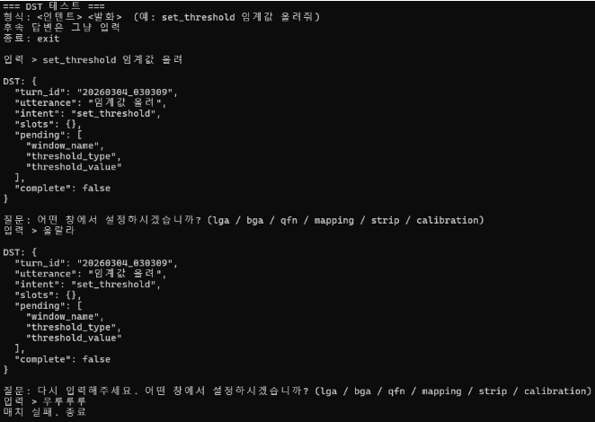

# LLM-based Inspection Command Classification

모호한 자연어로 입력된 검사 장비 명령어를   
안전하고 정확한 장비 API 호출로 연결하는 연구 프로젝트입니다.

---

## 1. Motivation

The system consists of:

- Contrastive Retrieval Module
- Slot Filling Module (Intent + Slot Prediction)
- End-to-end inference pipeline  

---
## 2. 📁 Project Structure

ragTest/  
│  
├── data/  
│   ├── action.json  
│   ├── category_description.json  
│   ├── dialogue_state.json  
│   ├── slot.json  
│   ├── slot_registry.json  
│   ├── retrieval/  
│   └── slot_filling/  
│  
├── experiment/  
│   ├── contrastive_retrieval_v1/  
│   └── slot_filling/  
│       ├── dataset.py  
│       ├── model.py  
│       ├── train.py  
│       ├── evaluate.py  
│       └── preprocess.py  
│  
├── src/  
│   ├── checkpoints/  
│   │   ├── chroma_action_db/  
│   │   ├── retrieval/  
│   │   └── slot_filling/  
│   │  
│   ├── dst_.py  
│   ├── run_pipeline.py  
│   └── run_inference.py  
│  
├── notebook/  
│  
├── README.md  
└── .gitignore  
  
---

## 2. Dataset

[Retrieval]  
- 약 2591개의 실제 검사 장비 명령어  
- 데이터 구성  
  - `text`: 자연어 명령  
  - `category`: 대분류(18개)    
- subCategory별 설명 문서(`category_description.json`) 구축  

data/retrieval  
├─ raw/  
├─ processed/  
│ └─ train / test  
└─ category_description.json  

[slot_filling]
- 약 3565 개의 발화로 구성
- 데이터 구성
  - utterance : 자연어 명령
  - intent : 상위 동작 유형 (예: system_setting, ui_navigation_execute 등)
  - slot_name : 예측 대상 슬롯
  - slot_type : categorical / span
  - candidates : categorical 슬롯의 후보 집합
  - status : ACTIVE / NONE 
  - value : 슬롯 값
  - span_start, span_end : span 기반 슬롯의 위치 정보

data/slot_filling  
├─ raw/  
├─ processed/  
│ └─ train / val / test / test2  

- train, vali, test 는 용량 문제로 샘플만 올림.

### test data (test_queries_fixed)
- data\processed\test_queries_labeled_url.csv
- step1, step2, step3 모듈이 공통으로 사용할 테스트셋 (246)
- 논문 실험에서도 공통적으로 사용하면 됨

---

## 3. Method

[retrieval]    
의미 기반 분류를 위해 **대조 학습 기반 Dense Retrieval** 방식을 사용.

- Embedding Model: SentenceTransformer (KoE5)
- Training:
  - (instruction, positive): 의미적으로 유사
  - (instruction, negative): 의미적으로 비유사
- Loss: CosineSimilarityLoss
- Retrieval: cosine similarity 기반 Top-k 검색

> 표현이 달라도 의미가 같으면 가까운 벡터로 학습

[slot_filling]    
명령을 구조화된 형태로 해석하기 위해 고정 스키마 기반 Intent + Slot 예측 구조를 사용  

- Backbone: KLUE-RoBERTa

- 구조:  
  - Slot Status (ACTIVE / NONE) 분류  
  - Categorical Slot 값 분류  
  - Span Slot start / end 예측  

status_head:  
- 슬롯을 보고 발화에 해당 정보가 있는지 없는지 확인    

Categorical Slot:  
- 사전 정의된 범주형 슬롯 후보 집합(candidates) 내에서 분류    

Span Slot:  
- 문장 내 비범주형 슬롯(숫자 데이터)의 토큰 위치 기반 값 추출  

자연어 명령을 고정된 UI 제어 구조로 정규화하도록 설계  

---

## 4. Experimental Setup

[retrieval]
- Evaluation Metrics
  - Top-1 Accuracy
  - Top-3 Accuracy
- Retrieval
  - Dense embedding + cosine similarity
- Latency
  - 실제 질의 기준 end-to-end 측정

[slot_filling]
Model  
- KLUE-RoBERTa 기반 인코더 사용  
- Intent 및 Slot 동시 예측 구조  

Evaluation Metrics    
- Status Classification: Macro-F1  
- Categorical Slot: Accuracy  
- Span Slot: Exact Match (EM), F1 Score  

Slot Prediction Strategy  
- Categorical 슬롯: 후보 집합(candidates) 기반 분류  
- Span 슬롯: 토큰 단위 start / end 예측  

Data Split  
- train / val / test 분리 후 test set 기준 평가하였으나   
  데이터 구조가 train과 유사한 관계로 test2 기준으로 평가  
    
---

## 5. Results

[retrieval]    
 - test    
 - utterance_intent.csv 에서 분리한 test 데이터  

| 지표 | finetuned |  
| --- | --- |   
| Accuracy@1 | **0.9653** |  
| Accuracy@3 | **0.9937** |  
| Accuracy@10 | **1.0000** |  
| NDCG@10 | **0.9808** |  
| MRR@10 | **0.9743** |  
| 평균 질의 시간 | 24.98ms |  
| Recall@1 오답 | 11 / 317 |  
| Recall@3 오답 | **2 / 317** |  

- 고정 데이터 셋  
| 지표 | finetuned |  
| --- | --- |  
| Accuracy@1 | **0.9715** |  
| Accuracy@3 | **0.9919** |  
| Accuracy@10 | **1.0000** |  
| NDCG@10 | **0.9854** |  
| MRR@10 | **0.9805** |  
| 평균 질의 시간 | 25.35ms |  
| Recall@1 오답 | 7 / 246 |  
| Recall@3 오답 | **1 / 246** |  

- 단일 예측에서도 높은 정확도
- Top-3 기준 실사용 가능한 성능
- 실시간 응답에 충분한 속도. 20ms

[slot_filling]

Status 분류 Macro-F1: 0.92       
Categorical Slot 전체 정확도: 93%         
Span Slot (EM / F1): 98%       
avg endToEnd Latency: 0.08s    
  
분석
- ACTIVE / NONE 상태 분류가 전반적으로 안정적인 성능을 보임  
- 대부분의 categorical 슬롯에서 90% 이상의 정확도를 달성  
- span 기반 슬롯(settingNumValue, threshold_value 등)은 모두 정확히 추출됨  

해석
- 고정 스키마 기반 설계와 후보 집합 제한(candidates) 방식이  
  산업용 명령 이해 환경에서 높은 안정성과 일관된 성능을 보임을 확인하였다.

---

### ⚠️ Model & Checkpoint Notice

본 레포지토리에는 **학습된 모델 체크포인트 및 대용량 벡터 DB 파일이 포함되어 있지 않습니다.**

- `src/checkpoints/retrieval/`
- `chroma_action_db/`
- `src/checkpoints/slot_filling/`

위 디렉토리는 용량 및 라이선스 이슈로 인해 GitHub에 업로드되지 않았습니다.

---

## 7. How to Run

python src/run_inference.py  
[주의]
- 래그 모델은 반드시 src\checkpoints\retrieval
안에 있어야한다  

자연어 명령을 받아 3단계로 API를 검색합니다.

1. **Stage 1** - KoE5 dense retriever로 subCategory 분류 (score ≥ 0.75: 자동확정 / ≥ 0.60: 후보 3개 반환 / < 0.60: 거절)
2. **Stage 2** - Chroma vectorstore에서 해당 subCategory의 API 후보 검색
3. **Stage 3** - ambiguity classifier로 분류 결과 모호성 검증

 

- 그 외에 retrieval이랑 Classifier 합친 부분  

python src/dst_.py
[주의]
- 슬롯필링 모델은 반드시 src\checkpoints\slot_filling
안에 있어야한다  

슬롯 필링 모델(KLUE-RoBERTa)을 기반으로 대화 상태를 추적합니다.

- 입력으로   
<intent> <발화>        
입력하면 슬롯 필링이 실행된다.   

- 슬롯 필링은 dst에 저장된다  

**흐름**
1. 첫 발화 → intent에 맞는 슬롯 전체 추론 → ACTIVE 슬롯 채움
2. NONE 슬롯 → 고정 질문으로 사용자에게 재질문
3. 답변 → 모델 재추론 (confidence ≥ 0.8) → 실패 시 1회 재질문 → 2회 실패 시 종료

**인텐트별 특이사항**
- `system_setting`: 수치/불리언/색상 6개 슬롯 동시 추론 → confidence 합산으로 그룹 확정. 전부 NONE이면 그룹 직접 질문
- `calibration_control`: `action_type` 먼저 확정 → 해당 타입에 필요한 슬롯만 추론
- `history_control`: `filter_type` 먼저 확정 → 해당 필터에 필요한 슬롯만 추론

  
